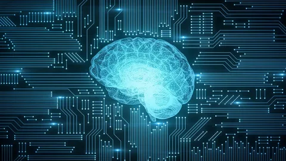

# Искусственный интеллект

## GB homework

HW1: [«1. Искусственный интеллект. Обзор»](./hw1/HW1.md)

---

HW2: [«2. Технологические возможности реализации ИИ»](./hw2/HW2.md)

---

HW3: [«3. Создание проекта машинного обучения»](./hw3/HW3.md)

---

HW4: [«4. Внедрение ИИ в организации»](./hw4/HW4.md)

---
