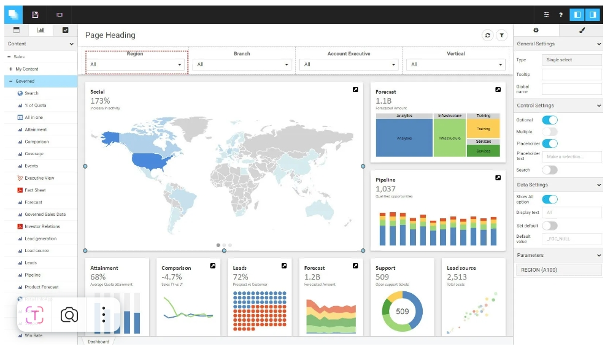

# HW1. Искусственный интеллект. Обзор

## Задание:

Выберите один из инструментов искусственного интеллекта.

- 📌узнайте больше об этом инструменте, его развитии и возможных будущих разработках;
- 📌определите интересующую вас отрасль (например, здравоохранение, финансы, образование или развлечения) и изучите, как инструмент ИИ используется в этой отрасли в настоящее время; - 📌опишите преимущества, которые этот инструмент дает отрасли, и любые потенциальные проблемы;
- 📌поразмышляйте об этических последствиях использования инструментов ИИ в выбранной отрасли. Обсудите потенциальные меры, которые могут быть приняты для решения этих этических проблем.

  Напишите отчет с кратким изложением ваших выводов. Отчет должен быть объемом 3-4 страницы (около 1500 слов) и включать ссылки на достоверные источники.
  Пожалуйста, убедитесь, что в вашем отчете есть введение, подробный анализ и продуманное заключение.

---

### Анализ инструмента WebFOCUS от Information Builders (ibi) в здравоохранении

---

1. Информация об инструменте, его развитии и возможных будущих разработках:

WebFOCUS — это платформa для бизнес-аналитики, разработанная компанией Information Builders (ibi). Инструмент позволяет организациям извлекать, анализировать и визуализировать данные из множества источников, предоставляя пользователям возможность создания интерактивных отчетов и дашбордов в реальном времени.

С момента своего запуска в 1975 году WebFOCUS претерпел значительные изменения и улучшения. Изначально он был разработан как инструмент для отчетности, но со временем расширил свои функции, интегрировав аналитику больших данных, возможности машинного обучения и искусственного интеллекта. Совсем недавно, ibi добавил более расширенные функции визуализации данных, улучшая пользовательский интерфейс и возможности интеграции с облачными сервисами.
В будущем ожидается, что WebFOCUS будет продолжать развиваться в следующих направлениях:

- Интеграция с AI: продолжение внедрения методов искусственного интеллекта для улучшения предсказательных аналитик и автоматизации бизнес-процессов.
- Улучшение пользовательского опыта: сосредоточение на доступности и простоте использования для пользователей без технического образования.
- Расширение функционала работы с большими данными: увеличение возможностей для обработки и визуализации разнообразных наборов данных.

---

2. Как этот инструмент применяется в здравоохранении в настоящее время:

WebFOCUS находит применение в здравоохранении в различных аспектах, включая:

- Сбор и обработка данных о пациентах. Платформа облегчает интеграцию данных, полученных из электронных медицинских записей (EMR), обеспечивая полную картину состояния здоровья пациента.
- Формирование отчетности. Медицинские учреждения используют WebFOCUS для создания регулярных отчетов о производительности, качестве медицинских услуг и понимания текущей ситуации в здравоохранении.
- Анализ клинических данных. WebFOCUS поддерживает исследовательские проекты и клинические испытания, предлагая мощные инструменты для обработки и анализа больших объемов данных.
- Мониторинг качества услуг. Инструмент помогает учреждению отслеживать качество оказываемых услуг через организацию эффективного анализа данных, что способствует лучшим клиническим решениям.

---

3. Подробный анализ применения этого инструмента в здравоохранении

- 3.1. Сбор данных и интеграция:
  одной из ключевых задач в здравоохранении является сбор и хранение данных о пациентах. WebFOCUS позволяет интегрировать информацию из различных источников, таких как EMR, лабораторные данные и страховки. Платформа может объединять разрозненные данные в единую базу, что позволяет медицинским учреждениям получать целостный взгляд на состояние здоровьем пациента.
- 3.2. Создание интерактивных отчетов:
  c помощью WebFOCUS учреждения здравоохранения могут генерировать интерактивные отчеты для различных секторов. Например:
- Отчеты для руководства: Сбор и анализ данных о производительности учреждения, такие как время ожидания, количество пациентов и результаты лечения.
  • Отчеты для медицинского персонала: Доступ к актуальным внутренним данным о пациентах для диагностики и лечения.
- 3.3. Поддержка клинических решений:
  WebFOCUS позволяет проводить глубокий анализ клинических данных, что, в свою очередь, способствует улучшению качества медицинских решений. С помощью инструментов визуализации данные о болезнях, эффективности лечения или исходах клинических испытаний могут быть представлены в доступном форме, что помогает врачам принимать решения на основе фактов.
- 3.4. Исследования и инновации:
  в рамках клинических испытаний WebFOCUS может быть использован для анализа данных, выявления закономерностей и проверки гипотез. Например, исследователи могут использовать инструмент для анализа большого объема данных клинических испытаний, чтобы выявить тенденции и адаптировать протоколы лечения.

---

4. Преимущества использования WebFOCUS в здравоохранении:

- Улучшение качества обслуживания пациентов. Быстрый доступ к актуальной информации о здоровье пациентов позволяет врачам принимать более обоснованные решения.
- Повышение эффективности работы. Автоматизация отчетности и анализа данных помогает оптимизировать рабочие процессы и уменьшить время, потраченное на рутинные задачи.
- Доступ к аналитике в реальном времени. Использование WebFOCUS обеспечивает возможность анализа данных в реальном времени, что позволяет быстро выявлять и реагировать на изменения в состоянии пациентов.
- Поддержка исследований. Платформа способствует улучшению клинических исследований, позволяя исследователям использовать данные для создания новых методов лечения и улучшения существующих практик.

---

5. Потенциальные проблемы применения этого инструмента

- Безопасность и конфиденциальность данных. Обработка чувствительных данных о здоровье требует строгого соблюдения норм защиты информации, что всегда сопряжено с риском.
- Сложности внедрения. Внедрение WebFOCUS в существующие системы может потребовать значительных усилий, включая расходы на обучение сотрудников и интеграцию с другими IT-системами.
- Технологическая зависимость. Организации могут столкнуться с возможной зависимостью от технологии, что делает их уязвимыми в случае сбоев или ошибок в системе.
- Предвзятость в аналитике. Используемые алгоритмы и модели могут привести к предвзятости в интерпретации данных, что может негативно повлиять на диагностику и лечение пациентов.

---

6. Этические вопросы, связанные с использованием WebFOCUS в здравоохранении, включают:

- Конфиденциальность данных: использование и хранение данных пациентов требует строгого соблюдения приватности, так как ошибки могут привести к серьезным последствиям, включая утечку конфиденциальной информации.
- Прозрачность данных: поскольку алгоритмы принимают решения на основе собранных данных, необходимо осознавать, как создаются эти данные и как они влияют на результаты анализа.
- Равенство доступа: неравный доступ к качественной аналитике и технологиям может привести к дальнейшему углублению социального неравенства в здравоохранении.
- Упущение информации: возможные предвзятости в обработке и анализе данных могут привести к тому, что важные данных будут проигнорированы.

---

7. Потенциальные меры для решения этих этических проблем

- Соблюдение стандартов конфиденциальности. Организации должны следовать законодательным требованиям и стандартам защиты данных, таким как HIPAA, предохраняя личную информацию пациентов.
- Увеличение прозрачности. Пациенты должны быть информированы о том, как используются их данные и для чего, что поможет укрепить доверие к учреждениям.
- Обучение персонала. Важность этичного обращения с данными должна быть подчеркиваться через обучение и программы повышения квалификации для сотрудников.
- Мониторинг и аудит. Регулярные проверки систем безопасности данных и алгоритмов помогут выявить и устранить возможные предвзятости и ошибки.

---

8. Заключение по использованию и перспективам развития этого инструмента

   WebFOCUS представляет собой ценный инструмент для анализа и работы с данными в здравоохранении, обеспечивая множество преимуществ, включая улучшение качества обслуживания пациентов и оптимизацию рабочих процессов. Однако важно тщательно следить за вопросами безопасности данных, этики и потенциальными предвзятостями в анализе. Устранение этих рисков и соблюдение стандартов могут не только помочь в максимально эффективном использовании WebFOCUS, но и укрепить доверие пациентов к платформе и самой отрасли здравоохранения.
   С учетом постоянно развивающихся технологий, WebFOCUS имеет огромные перспективы для дальнейшего роста в области аналитики, внедрения искусственного интеллекта и улучшения пользовательского опыта. С правильно внедренными мерами по управлению рисками и соблюдению этических стандартов, этот инструмент способен значительно изменить ландшафт здравоохранения в сторону более точного и обоснованного использования данных.

---

Ссылки на достоверные источники

1. [Information Builders](https://www.ibi.com/) - официальный сайт WebFOCUS
2. [Ethical Considerations for the Use of AI in Healthcare.](https://www.ncbi.nlm.nih.gov/pmc/articles/PMC7025387/)
3. HIPAA Compliance - U.S. Department of Health and Human Services
4. [Ethical Issues in Data Analytics](https://hbr.org).
5. [Использование бизнес-аналитики в здравоохранении](https://www.forbes.com)
