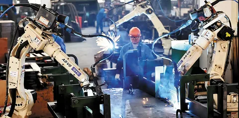
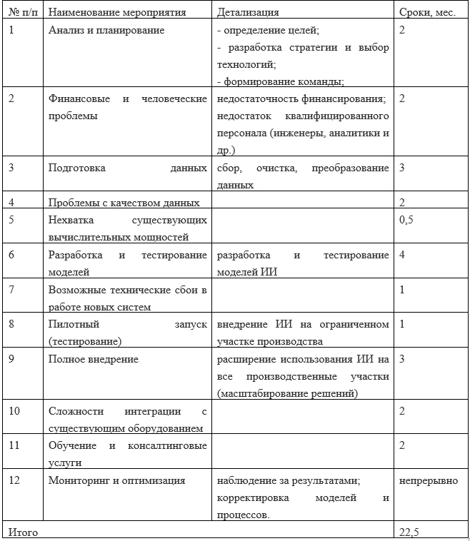

# HW4. Внедрение ИИ в организации

## Задание:

Вы были наняты в качестве консультанта производственной компанией, которая хочет изучить потенциальные преимущества внедрения ИИ в свой производственный процесс. Компания производит бытовую электронику и стремится повысить эффективность, сократить количество отходов и улучшить качество продукции.

Ваша задача - подготовить отчет, в котором будет изложен план внедрения ИИ для производственной компании.
В отчете должны быть рассмотрены следующие аспекты:

### <u>1. Дайте обзор компании и ее производственного процесса</u>

Четко сформулируйте задачи и цели внедрения ИИ в производственный процесс.

### <u>2. Проанализируйте текущий производственный процесс и определите потенциальные области, в которых ИИ может принести улучшения</u>

Рассмотрите такие аспекты, как контроль качества, предиктивное обслуживание, оптимизация цепочки поставок или эффективность производственной линии.

### <u>3. Предложите конкретные методы, алгоритмы или технологии ИИ, которые могут быть использованы для решения выявленных возможностей </u>

Объясните, как каждое предлагаемое решение ИИ может улучшить производственный процесс и достичь желаемых целей.

### <u>4. Опишите типы данных, которые необходимо собрать и использовать для внедрения ИИ</u>

Обсудите методы сбора, хранения и интеграции данных в производственный процесс.

### <u>5. Разработайте пошаговый план внедрения ИИ в производственный процесс</u>

Включите сроки, требования к ресурсам и потенциальные проблемы, которые могут возникнуть в процессе внедрения. Рассмотрите такие аспекты, как приобретение технологий, обучение сотрудников и управление изменениями.

### <u>6. Оцените ожидаемые выгоды от внедрения ИИ</u>

Оцените ожидаемые выгоды от внедрения ИИ, такие как повышение эффективности производства, сокращение отходов, повышение качества продукции или экономия затрат.

### <u>7. Обсудите потенциальные этические соображения, которые могут возникнуть при внедрении ИИ в производственный процесс</u>

Предложите стратегии и меры по обеспечению ответственного и этичного внедрения ИИ, учитывая такие аспекты, как конфиденциальность, предвзятость и прозрачность.

---

### <u>1. Внедрение ИИ в производственный процесс:</u>

**Цели:**

- улучшение репутации компании (как развивающей инновации и новые технологии);
- увеличение прибыли;
- повышение удовлетворенности клиентов;
- повышение эффективности производства;
- улучшение качества продукции;
- ускорение времени выхода новых продуктов на рынок;
- снижение производственных затрат;
- сокращение количества отходов.

**Задачи внедрения ИИ в производственный процесс:**

- _совершенствование производственных процессов:_ автоматизация рутинных задач, прогнозирование и предотвращение задержек, планирование производственного графика с учетом спроса и ресурсов, оптимизация распределения ресурсов, как пример - использование роботизированных решений для сборки, что уменьшит человеческий фактор, повысит скорость и точность, увеличит производительность;
- _автоматизация контроля качества:_ использование компьютерного зрения для автоматического выявления дефектов продукции, выявление дефектов на ранних стадиях, повышение точности производства;
- _прогнозирование и минимизация брака:_ оптимизация использования материалов, автоматизация процесса переработки отходов;
- _оптимизация управления запасами:_ своевременное реагирование на изменения в спросе и минимизация избыточных запасов;
- _прогнозирование спроса:_ предсказание будущих потребностей рынка, оптимизация запасов и планирование производства;
- _улучшение обслуживания клиентов:_ быстрая обработка заявок, персонализированные рекомендации, прогнозирование потенциальных проблем.
- _ускорение разработки новых продуктов:_ использование ИИ для анализа данных и генерации идей, ускорение процесса прототипирования.

### <u>2. Обзор основных потенциальных областей текущего производства, в которых ИИ может принести улучшения</u>

- _контроль качества:_ ИИ позволит более точно отслеживать параметры процессов и выявлять отклонения от нормы на этапе производства, что приведет к снижению процентного соотношения брака (например, использование компьютерного зрения для автоматической проверки качества продукции на всех этапах производства даст прогнозируемое снижение брака на 15-20%, повысит точность контроля);
- _предиктивное обслуживание:_ анализ данных о состоянии оборудования для прогнозирования поломок и планирования профилактических работ, снижение простоев на 10-15%, снижение затрат на ремонт;
- _оптимизация цепочки поставок:_ прогнозирование спроса, оптимизация маршрутов доставки, прогнозирование возможных сбоев, сокращение времени доставки на 5-10%;
- _эффективность производственной линии:_ автоматизация управления производственными линиями, оптимизация расхода материалов, снижение времени производства до 15%;
- _управление запасами:_ прогнозирование спроса и оптимизация запасов, минимизация излишков и дефицита, снижение затрат на хранение на 5-10%.
- _персонализация продукции:_ использование ИИ для персонализации продукции на основе данных о предпочтениях клиентов, увеличение удовлетворенности клиентов.

### <u>3. Методы, алгоритмы или технологии ИИ, которые могут быть использованы для решения выявленных возможностей</u>

- алгоритмы машинного обучения: позволят оптимизировать процессы, находить наиболее эффективные пути производства, минимизируя затраты времени и ресурсов;
- предиктивное обслуживание: увеличивает продолжительность жизни оборудования и минимизирует расходы на ремонт, так как предотвращает серьезные поломки;
- прогнозирование: оптимизация цепочки поставок и управление запасами способствуют для рационального использованию ресурсов и материальных средств;
- использование компьютерного зрения: позволит быстро выявлять отклонения от стандартов качества, что существенно улучшит конечный продукт.

### <u>4. Необходимые данные и методы их обработки:</u>

**Типы данных:**

- технологическая информация о производственном процессе: время цикла, количество произведенной продукции, параметры оборудования, расход материалов, количество отходов;
- данные о качестве продукции: результаты проверок, изображения дефектов, отклонения, уровень дефектов;
- данные о спросе: данные продаж, прогнозы рынка, отзывы;
- данные о состоянии оборудования: измерения параметров, данные о поломках. информация о техническом обслуживании, история ремонтов;
- информация о поставках: данные о поставщиках, сроках доставки, запасах на складах.

**Методы сбора:**

- применение IoT для связи между устройствами и централизованными системами данных: датчики и сенсоры, устанавливаемые для сбора данных в реальном времени;
- автоматизированные системы учета материалов;
- инструменты для анализа и мониторинга данных в реальном времени.

**Методы хранения и интеграции:**

- использование систем хранения больших данных в облачных системах;
- локальные СУБД;
- разработка ETL-процессов для интеграции данных из различных источников;
- использование систем MES (Manufacturing Execution Systems) для интеграции данных, обеспечение их доступности для аналитики.

#### <u>5. План внедрения:</u>

### <u>6. Ожидаемые выгоды от внедрения ИИ</u>

Оценить эти выгоды можно через показатели производительности, такие как снижение показателей рекламаций, увеличение производственных мощностей и улучшение рентабельности, сравнение затрат и доходов до и после внедрения ИИ, мониторинг ключевых показателей эффективности (KPI):

- эффективность производства: увеличение до 10-15%;
- сокращение отходов: снижение не ниже 10-15%;
- повышение качества продукции: увеличение на 15-25%;
- экономия затрат: снижение затрат на 5-10%.

### <u>7. Потенциальные этические и правовые соображения при внедрении ИИ</u>

**Этические соображения:**

- конфиденциальность: защита данных о производственном процессе, клиентах и сотрудниках;
- предвзятость: проверка моделей на наличие предвзятости и корректировка;
- прозрачность: понимание, как ИИ принимает решения, и возможность их пересмотра;
- ответственность: установление ответственности за решения, принимаемые ИИ;
- защита: подготовка персонала к новым задачам и обязанностям, переобучение, возможно создание новых рабочих мест.

**Стратегии и меры:**

- разработка этического кодекса для использования и оценки ИИ;
- проведение аудита моделей на предмет предвзятости;
- разработка механизмов прозрачности работы моделей ИИ;
- обучение персонала этическим аспектам использования ИИ.

**Таким образом, внедрение ИИ в производственном процессе компании по производству бытовой электроники не только приведет к улучшениям в эффективности и качестве продукции, но и создаст новые вызовы, которые необходимо решать в процессе реализации стратегии.**
